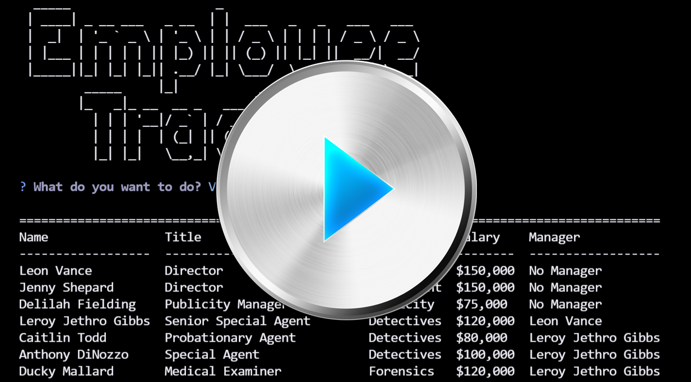

# Employee Tracker
This challenge for Module 12 of the Coding Bootcamp is to create an app to track employees.

* [User Story](#userStory)

* [Requirements](#requirements)

* [Bonus Requirements](#bonusRequirements)

* [Extra Functionality I added](#extraFunctionality)

* [Technologies Used](#techUsed)

* [What I Learned](#whatILearned)

* [Employee Tracker Screenshot](#webImage)

* [Employee Tracker Demo](#projectDemo)

* [Contact Me](#contactMe)

---

## User Story

* AS A business owner
* I WANT to be able to view and manage the departments, roles, and employees in my company
* SO THAT I can organize and plan my business
--- 

## Requirements
* When the command line application starts up, the user is presented with the following options:
    * View all departments ✔️
        * The user is presented with a formatted table showing department names and department ids
    * View all roles ✔️
        * The user is presented with the job title, role id, the department that role belongs to, and the salary for that role
    * View all employees ✔️
        * The user is presented with a formatted table showing employee data, including employee ids, first names, last names, job titles, departments, salaries, and managers that the employees report to
    * Add a department ✔️
        * The user is prompted to enter the name of the department and that department is added to the database
    * Add a role ✔️
        * The user is prompted to enter the name, salary, and department for the role and that role is added to the database
    * Add an employee ✔️
        * The user is prompted to enter the employee’s first name, last name, role, and manager and that employee is added to the database. An employee is not required to have a manager.
    * Update an employee role ✔️
        * The user is prompted to select an employee to update and their new role and this information is updated in the database
* The database schema must follow this schema:

    * Department:
        * id: INT PRIMARY KEY
        * name: VARCHAR(30) to hold department name
    * Role
        * id: INT PRIMARY KEY
        * title: VARCHAR(30) to hold role title
        * salary: DECIMAL to hold role salary
        * department_id: INT to hold reference to department role belongs to

    * Employee
        * id: INT PRIMARY KEY
        * first_name: VARCHAR(30) to hold employee first name
        * last_name: VARCHAR(30) to hold employee last name
        * role_id: INT to hold reference to employee role
        * manager_id: INT to hold reference to another employee that is manager of the current employee. This field might be null if the employee has no manager.

---

## Bonus Requirements

* Update employee managers. ✔️
* View employees by manager. ✔️
* View employees by department. ✔️
* Delete:
    * departments ✔️
    * roles ✔️
    * employees ✔️
* View the total utilized budget of a department—in other words, the combined salaries of all employees in that department. ✔️

---

## Extra Functionality

* View all employees by role. ✔️
* View Employee Detail.✔️
    * I wanted this one so I could look at the changes the 'user' (me, as tester) made without having to show all employees and then manually looking through the whole table for the modified employee. After I added this, I added the functionality listed below this one, which made this unnecessary to its original purpose, but I left it anyway.
* After updating an employee (manager or role), display the employee details. ✔️

---

## Technologies Used
* Inquirer
* Mysql2.0
* Console table package
* Node
* JavaScript

--- 

## I learned how to
* Configure a Node.js application to connect to a MySQL database.
* Create and drop databases and tables.
* Use CRUD (create, read, update, and delete) methods to work with persistent data.
* Create schema and seed files for the development of your application.
* Write join statements to establish relations between data in three separate tables using primary and foreign keys.
* Explain the use and importance of prepared statements.

---

## Employee Tracker Screenshot

---

## Employee Tracker Demo

---

## Contact Me
You can reach me, Brenda Jackels, at bjackels5@gmail.com.
